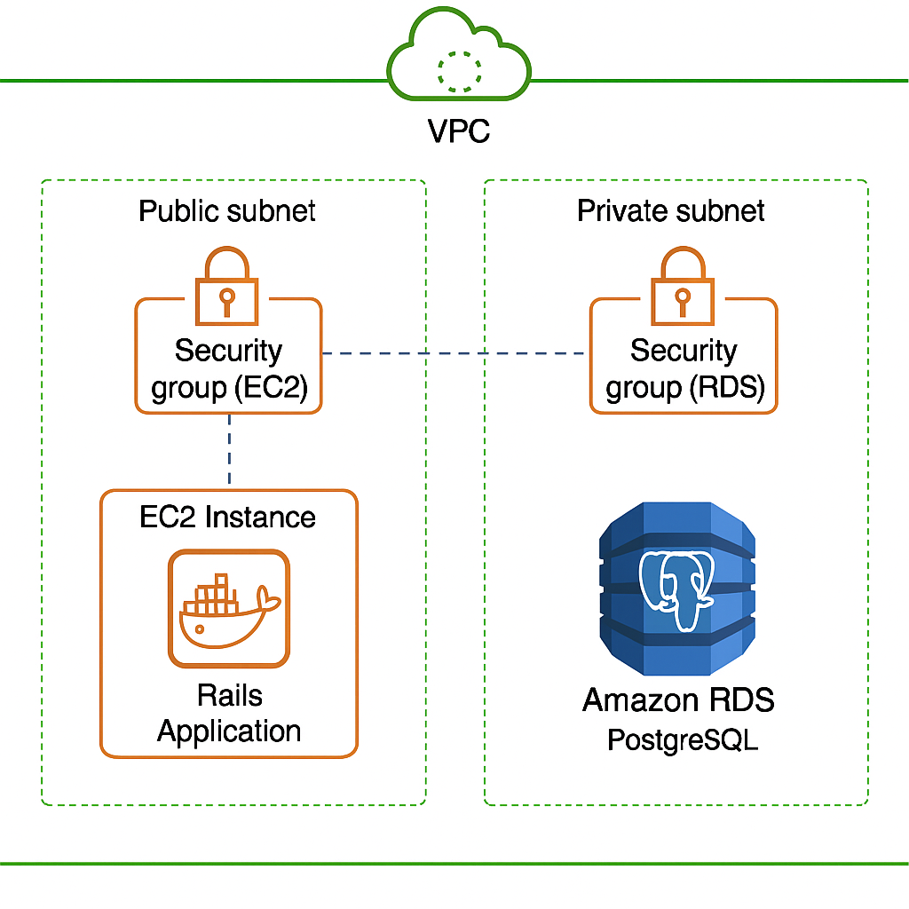

# README

System for booking desks in a shared office space with AWS deployment.

Things you may want to cover:

* Ruby version: 3.1.2

* System dependencies: Rails 7.0.4

* Configuration

For Unix-Like <Ubuntu> install postgres libs for dev:

sudo apt-get install libpq-dev


* Database creation: PostgreSQL Development with Docker
* Database initialization:
Create image with: `docker build -t postgres_plats .Postgres.Dockerfile`
Run container with: `docker run -d --name appdb -p 5432:5432 -v appdb_data:/var/lib/postgresql/data postgres_plats`


* How to run the test suite

* Services (job queues, cache servers, search engines, etc.)

* Deployment instructions
With terraform
´´´
terraform init
terraform validate
terraform apply -var-file="secrets.tfvars"
´´´

* ...


## Deployment with AWS Serives

The service can be deployed to a AWS project following the below architecture.

- An EC2 Instance running a docker image of the rails app
- The app connects through a private secured Amazon RDS PostgreSQL database.



## Deployment Scripts
#### Building the docker image
Before creating the image a docker hub account must be created
and within a repository for the rails app. Then login using the following command-
```
docker login

```

Then run the <b>build-image-sh</b> script for create the docker container with the corresponding tag and push it to docker hub.
<i>please note that the repository name must be updated
for the one created in the prior step.</i>

### Deploy to AWS with Terraform

Within the ./terraform folder there are the scripts for the architecture mentioned above.